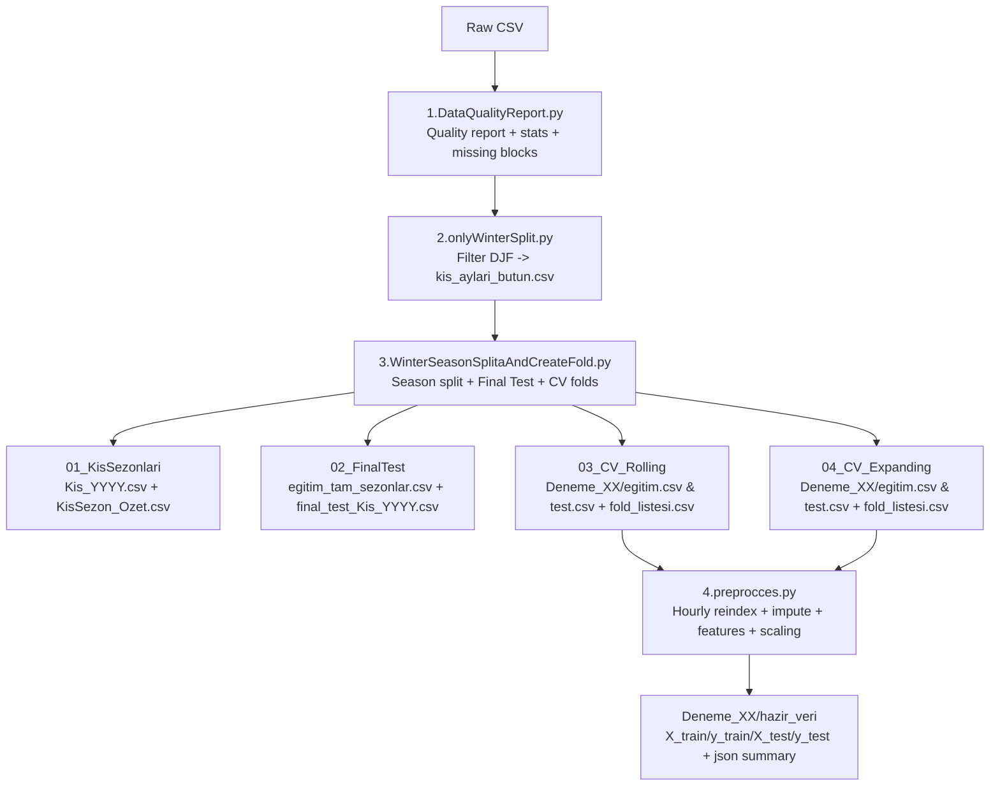

# DataPreProcesses (Bitirme-2) — Winter (DJF) Data Pipeline

A compact Python data-preprocessing pipeline for **winter-only (DJF: Dec–Jan–Feb)** wind-speed forecasting experiments.  
It produces **season-based splits**, **walk-forward CV folds (Rolling/Expanding)**, and **model-ready features** with strict **data-leakage guards**.

---

## Tech Stack (What we used)

- **Python 3.10+**
- **pandas** (CSV IO, time indexing, grouping)
- **NumPy** (math & feature transforms)
- **scikit-learn** (`MinMaxScaler`)
- **pathlib** (cross-platform paths)
- **JSON** (summaries / run metadata)
- Data format supported: **NASA POWER** style CSV (YEAR/MO/DY/HR + WS50M) and legacy `DateTime/Speed` (auto-detected in preprocess).

---

## Pipeline Overview (Diagram)

.

What this repo does (Summary)

Data Quality (Script 1)

Builds timestamps (NASA POWER: YEAR/MO/DY/HR → DateTime_LST)

Reports missing hours, missing blocks, duplicates, basic stats, IQR outliers

Exports CSV + JSON summaries

Winter Filtering (Script 2)

Filters only DJF months (12, 1, 2)

Creates kis_aylari_butun.csv (combined winter data)

Season Split + Walk-Forward Folds (Script 3)

Splits by Winter Season Year:

Jan/Feb → same year

Dec → year + 1
Example: 2020-12 + 2021-01 + 2021-02 = WinterSeasonYear 2021

Picks the last full season as Final Test

Generates Rolling and Expanding walk-forward folds

Preprocess → Model-ready data (Script 4)
For each fold:

hourly reindex (missing hours become rows)

limited time interpolation for short gaps (default: up to 6 hours)

leakage-safe features:

lag_* from past values

roll_mean_* / roll_std_* using shift(1) (current time not included)

hour_sin, hour_cos

target: t+1

MinMaxScaler fit only on train, transform test

exports hazir_veri/ outputs

Expected Columns

Preferred (new pipeline / NASA POWER):

Time column: DateTime_LST

Target column: WS50M

Preprocess (Script 4) also auto-detects legacy names:

DateTime, Speed

Note: Scripts 2–3 assume winter-filtered input exists as Desktop/bitirme-2/kis_aylari_butun.csv (or bütün).

Output Folder Structure

After running, the pipeline creates:

Desktop/bitirme-2/

00_Girdi/ : a copy of the input file used

01_KisSezonlari/ : Kis_YYYY.csv + KisSezon_Ozet.csv

02_FinalTest/ : egitim_tam_sezonlar.csv + final_test_Kis_YYYY.csv

03_CV_Rolling/ : Deneme_XX/egitim.csv & test.csv + fold_listesi.csv

04_CV_Expanding/ : Deneme_XX/egitim.csv & test.csv + fold_listesi.csv

99_LOG/ : logs

Each fold: Deneme_XX/hazir_veri/ (model-ready outputs)

Installation (Friend can clone & run locally)
1) Clone the repository
git clone https://github.com/meren01/DataPreProcesses.git
cd DataPreProcesses
2) Create and activate a virtual environment (recommended)

Windows (PowerShell)

python -m venv .venv
.\.venv\Scripts\activate

macOS / Linux

python3 -m venv .venv
source .venv/bin/activate
3) Install dependencies
pip install pandas numpy scikit-learn
How to Run (in correct order)

Before running, update the input path/filename inside the scripts if needed.

Quality Report

python 1.DataQualityReport.py

Winter Filter (DJF)

python 2.onlyWinterSplit.py

Season Split + CV Folds

python 3.WinterSeasonSplitaAndCreateFold.py

Preprocess (Fold → model-ready hazir_veri)

python 4.preprocces.py
Leakage Guards (Important)

Train/Test are never concatenated.

MinMaxScaler is fit on train only, then applied to test.

Rolling features use shift(1) so no current-time leakage.

Test imputation uses only test internal information.

Notes / Common Issues

If fold_listesi.csv cannot be found, make sure Script 3 ran successfully and created:

Desktop/bitirme-2/03_CV_Rolling/fold_listesi.csv or

Desktop/bitirme-2/04_CV_Expanding/fold_listesi.csv

If Script 3 complains about “not enough full seasons”, you need at least 3 full DJF seasons to run walk-forward safely.
